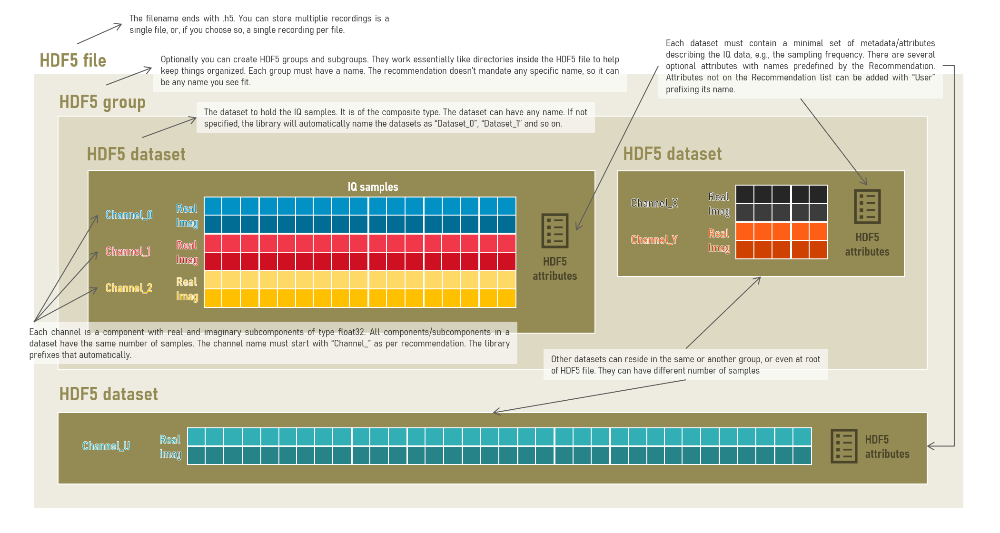
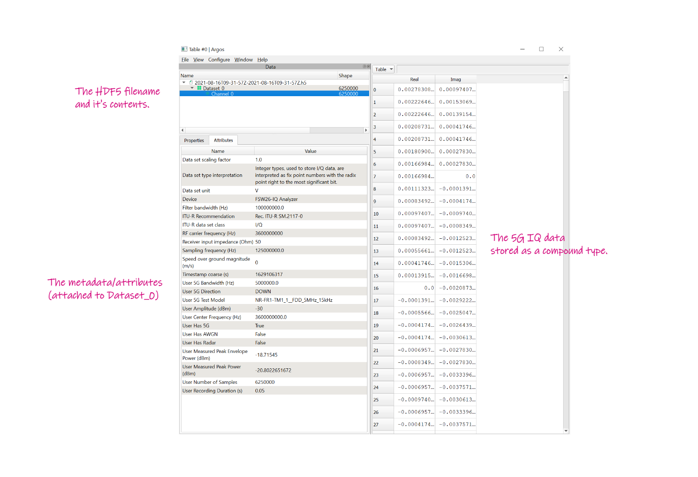

# ITU-R SM.2117-0 Python Library

This is a HDF5 read/write Python library for the data format in [Recommendation 
ITU-R SM.2117-0](https://www.itu.int/rec/R-REC-SM.2117-0-201809-I) Data format 
definition for exchanging stored I/Q data for the purpose of spectrum monitoring. It is supported by [Key Bridge Wireless](https://keybridgewireless.com/) as a
contribution to IEEE 1900.8 Working Group.
___


## Quick start
Installation
```bash
pip install itusm2117
```

Writing data
```python
import numpy as np
from itusm2117 import write_iq_dataset

# The data: a list or np.array with complex values.
# Other data types and shapes are possible, check the docs.
iq = [1+1j, 2+2j, 3+3j, 4+4j]

# The only mandatory metadata of the Recomendation that
# doens't have a default or fixed value is the Sampling Frequency
# in Hertz.
sampling_frequency = 125e6

# Method for writing the data. First argument is the filename.
# By default, it will store the iq data on a dataset named
# "Dataset_0" and channel named "Channel_0".
write_iq_dataset("my_iq_data.h5", iq, sampling_frequency)
```

Reading data
```python
from itusm2117 import read_iq_dataset

# Method for read the data. First argument is the filename and 
# the second is the dataset name.
metadata, recordings, channels = read_iq_dataset("my_iq_data.h5", "Dataset_0")
# metadata: A dict with the key-value pairs of metadata from "Dataset_0".
# recordings: np.array of complex64 with the IQ data. First dimension is the channel.
# channels: List with the channels names (can be only one).
```
___
## Table of contents

  - [Quick start](#quick-start)  
  - [About the format](#about-the-format)  
  - [Installation](#installation)
  - [Limitations](#limitations)
  - [License](#license)
  - [Contact](#contact)
  - [Contributing](#contributing)
  - [How to](#how-tos)
    - [Store I/Q data into H5 groups <a name="groups"></a>](docs/howtos.md#storing-iq-data-into-h5-groups)
    - [Name I/Q datasets](docs/howtos.md#naming-iq-datasets)
    - [Name channels <a name="channels"></a>](docs/howtos.md#naming-channels)
    - [Supported data types and shapes](docs/howtos.md#supported-data-types-and-shapes)
    - [Add metadata <a name="metadata"></a>](docs/howtos.md#adding-metadata)
___

## About the format

The HDF5 is a generic and flexibe file format for storing data and metadata. The ITU-R SM.211-0 Recommendation describes a way to store IQ data using the HDF5 format. Bellow is a overview of format and the Recommedation.




You can check the contents of a given HDF5 file using a desktop application called [Argos](https://github.com/titusjan/argos). Bellow is an examples of a file opened with Argos that follows the specs in the Recommendation.


___


## Installation
```bash
pip install itusm2117
```
Direct dependencies:
- **numpy**, for array manipulation.
- **h5py**, for reading and writing HDF5 files.
- **cerberus**, for metadada validation & normalization.
___

## Limitations

Currently this library does not support the the following specs of the Recommendation:
- Multisector datasets, which is used for IQ recordings with metadata changing over time
- Bitfield datasets. This is used for marking each sample of a recording with specific flags.
- Integet datasets. Currently all datasets are stored as float32.
___

## License
[MIT](./LICENSE)
___

## Contact
Contact us through GitHub for any comments, questions or pull requests.
